Application Note

**Ensemble®**

**MCU and Fusion Processors**

**Power Modes**

**Version 1.7**

# Introduction

This Application Note covers the RTSS sub-systems with the Cortex**®** M55 CPUs in any of the Alif Semiconductor**®** Ensemble**®** family of MCUs. By the end of this document, you will be able to exercise some of the power saving features and measure results matching the datasheet.

## Reference Documents

### Power Saving Features White Paper

Start by reading the Power Saving Features White Paper to learn about the overall MCU architecture and power saving features available in Ensemble processors. Using the white paper, you should become familiar with the processor’s operating regions and the hierarchy of its power domains. You will be introduced to the resources available in each operating region, the supported operating states, the wake-up sources that can be used, and the many power saving features implemented in the processor.

[Power Saving Features](https://alifsemi.com/download/AWPR0002)

### Ensemble Hardware Reference Manual

The Hardware Reference Manual (HWRM) describes all technical features of the Ensemble processors down to the register level. Use this document to reference things like the device block diagram, clock tree, power domain tree, CPU interrupt maps, DMA event routing, and register descriptions.

[Reference manuals](https://alifsemi.com/support/reference-manuals/ensemble/)

## Equipment

Alif Ensemble development kit (DevKit), such as the DK-E7, DK-E8 or DK-E1C/B1. When loading the examples in this application note onto the board, there is no code loaded for the A32 cores, so they are off by default.

Power measurements can be made using any equipment of your choice. If a recommendation is needed, please see the Joulescope JS220 ([www.joulescope.com](http://www.joulescope.com)). Its software is supported on Windows, macOS, and Ubuntu 22.04 LTS.

## Software

Download the following packages to begin evaluating the Ensemble Power Modes example software.

- app-release-exec-\<os\>-SE_FW_1.107.000, or later (\<os\> supported: windows, linux, macos)

- se-host-services-release-SE_FW_1.107.000, or later

## Evaluation Board Setup

### Connections between Joulescope and Ensemble E8 DevKit

To begin measuring power you will need to cut a shunt S5 on the rear of the Ensemble E8 DevKit and you will need to install a jumper on JP2. After cutting S5 and installing JP2, the MCU will only be powered by a jumper installed on JP2. To supply 3.3V to the MCU, short JP2 pin 2 to JP2 pin 3. To supply 1.8V to the MCU, suprt JP2 pin 2 to JP2 pin 1. To measure current, you will connect a current measurement device on JP2. Current is sourced from either 1.8V or 3.3V generated by supplies on the DevKit, passes through your current measurement device, and sinks to JP2 pin 2. For calculating power, the voltage is measured at "VDD_MAIN", i.e. JP2 pin 2.

On E8, please remove the jumper on JP2. You can choose to measure the voltage at 1.8V or 3.3V.
<figure>
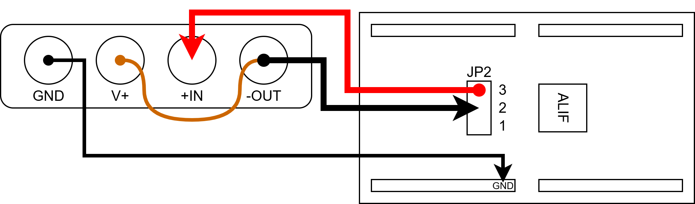
<figcaption>
Electrical Connections to Ensemble E8 DevKit
</figcaption>
</figure>

### Connections between Joulescope and Ensemble E7 DevKit

To begin measuring power you will need to remove the jumper that is pre-installed on J5 of the Ensemble DevKit. Then you will connect a current measurement device as shown in the image below. GND on the Devkit can be found on pin 1 of any of the four main headers. The 3.3V supply is sourced from J5 pin 2, passes through the current shunt or analyzer, and sinks to J5 pin 1. For calculating power, the voltage is measured at the output on J5 pin 1.

<figure>

<figcaption>
Electrical Connections to Ensemble E7 DevKit
</figcaption>
</figure>

#### Ensemble E7 DevKits Before Hardware Revision D

Prior to hardware revision D of the DevKit (the revision is visible on the back side of the PCB near jack J23), the CPU Power Supplies schematic looked like Figure 2 CPU Power Supplies Before Rev D which combined VDD_USB_3V3 with other MCU supplies on supply VDD_3V3 after jumper J5 and did not include VDD_BATT. When measuring current on J5, please note that the VDD_USB_3V3 supply contributes an additional 123 uA of always-present leakage added to the total MCU current and you will not see any power consumption due to VDD_BATT. Starting with hardware revision D the VDD_USB_3V3 supply can be disconnected using a newly added Jumper J31. VDD_BATT is now connected after J5 using VDD_3V3.

<figure>

<figcaption>
CPU Power Supplies Before Rev D
</figcaption>
</figure>

### Connections between Joulescope and Balletto B1 / Ensemble E1C DevKit

To begin measuring power you will need to cut a shunt SH3 on the rear of the DevKit and you will need to install a jumper on JP3. After cutting SH3 and installing JP4, the MCU will only be powered by a jumper installed on JP3. To supply 3.3V to the MCU, short JP3 pin 2 to JP3 pin 1. To supply 1.8V to the MCU, suprt JP3 pin 2 to JP3 pin 3. To measure current, you will connect a current measurement device on JP3. Current is sourced from either 1.8V or 3.3V generated by supplies on the DevKit, passes through your current measurement device, and sinks to JP3 pin 2. For calculating power, the voltage is measured at "VDD_MAIN", i.e. JP3 pin 2.

On the Devkit, please remove the jumper on JP3. You can choose to measure the voltage at 1.8V or 3.3V.
<figure>
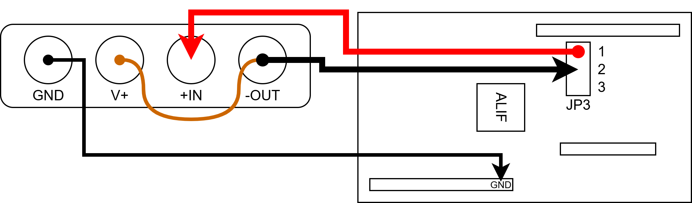
<figcaption>
Electrical Connections to Balletto B1 / Ensemble E1C DevKit
</figcaption>
</figure>

# CPU Power States

## CPU Sleep State

Use the CPU Sleep state when there is no work to do until the next CPU interrupt occurs. Putting the core to sleep reduces clocking activity within the core without affecting other parts of the MCU. Upon receiving an interrupt, the CPU will exit the sleep state and jump to the ISR to service it. After that the CPU will resume running the application from where it last entered the sleep state.

There are two possible sleep types: normal sleep and deep sleep. Both sleep types are considered power saving states which reduce clocking activity within the core, though deep sleep is a lower power state with additional components being clock gated. When using normal sleep, the NVIC is retained and therefore any interrupt from 0-479 can be used to wake up the CPU. However, when using deep sleep, the M55 core’s TCM is clock gated and only the first 0-63 positions of the interrupt controller are available. Refer to the *M55-HP Interrupt Map* and *M55-HE Interrupt Map* tables in the Hardware Reference Manual. Rows that are color-coded yellow are interrupt sources which work in both normal sleep and deep sleep states.

## CPU Off State

Use the CPU Off state to power off the CPU core until the next wakeup event occurs. Powering off the core will power down the whole RTSS and any components within it, including the TCM1 and certain LP- peripherals in the case of RTSS-HE2. Due to the loss of power in the CPU, the application loses its current state. Upon wakeup, the core will restart the application beginning with its reset vector. The reset vector is saved before the CPU core powers down and must point to a memory location that is retained while the CPU is off.

### Waking from CPU Off State

Wakeup sources from the CPU Off state are limited to those shown in the Table 1 CPU Off State Wakeup Sources below. To exercise, simply configure one of the peripherals below to generate an interrupt after the core powers off, then enable the IRQ in the NVIC, and finally enter the CPU Off state. When the wakeup event is received, the CPU will begin running the application from the reset vector. At this point the pending interrupt can be observed in the NVIC pending registers and the application can take the appropriate action in response.

| Wakeup Source  | Destination         |
|:---------------|:--------------------|
| LPI2C          | RTSS-HE             |
| LPUART         | RTSS-HE             |
| LPCMP          | RTSS-HE and RTSS-HP |
| LPGPIO\[7:0\]  | RTSS-HE and RTSS-HP |
| LPRTC          | RTSS-HE and RTSS-HP |
| LPTIMER\[3:0\] | RTSS-HE and RTSS-HP |
| MHU IRQs       | RTSS-HE and RTSS-HP |

CPU Off State Wakeup Sources

1RTSS-HE’s TCM can be optionally retained while the RTSS-HE subsystem is off. The HE core’s reset vector can be within TCM if it is retained. RTSS-HP TCM is not retainable, and its contents will be lost. The HP core’s reset vector should be within SRAM0/1 or MRAM and anything required to be in TCM will need to be copied to it.

2RTSS-HE PD-3 power domain includes: LPI2S, LPPDM, LPCPI, LPSPI, and APB bus for accessing peripherals in PD-0 or PD-2: LPRTC, LPGPIO, LPTIMER, LPUART, and LPI2C. The RTSS-HE power must be on to access these peripherals listed.

Note that since the application loses its current state when powering off there needs to be an external mechanism for the application to know if it has been executed before or if it is the first time running. It is possible to use the shared 4kB Backup SRAM for this purpose. This memory is optionally retained while other subsystems are powered down, including through Standby and Stop modes.

# MCU Power Modes

## PD-6 SYST

This section describes the power control of PD-6 SYST. There are two possible power states that applications can choose from for PD-6 SYST, that is either: always-on or dynamic-off.

There are many shared resources that reside in PD-6 SYST. These resources include the main system interconnect, SRAM0/1 memory banks, MRAM, DMA0, and all shared peripherals (0x4800_0000 to 0x49FF_FFFF range).

The default system configuration is to keep PD-6 SYST in the always-on state. This allows applications to freely use all the shared peripherals and SRAM0/1 memory banks without special considerations. While in this state you can individually turn on and off power to SRAM0 and SRAM1 depending on the application usage of those memories and for power saving reasons. The shared peripherals can also be individually clock gated or un-gated for power savings. In this state the power to PD-6 is always on, so the peripherals don’t lose their configuration and there is minimal latency for accessing MRAM or SRAM.

Configuring PD-6 SYST to be dynamic-off will allow the shared resources to power off when not being accessed. That saves power but it means SRAM0 and SRAM1 banks will lose their contents, and the shared peripherals will lose their configurations each time PD-6 is off since they all reside in the same power domain. While PD-6 is dynamic-off, there are still resources outside of PD-6, such as LP- peripherals in PD-0 and PD-2 and SRAMs in PD-4 that are still retained. Many device configuration registers are also in these lower power domains, so their contents are not lost while PD-6 is dynamic-off. Any bus transactions which pass through the main interconnect within SYST will turn on the power domain but only long enough to service the transfer.

This dynamic-off feature is for applications running on the RTSS-HP or RTSS-HE to be in a limited and low-power state where they are using only TCM, MRAM, and peripherals within PD-0 and PD-2. In this scenario, application code can be stored in MRAM or TCM or a mix of the two. The instruction and data caches beside the M55 cores will help to reduce the need to read things from MRAM while XIP.

## E4 Datasheet Power Modes

<figure>
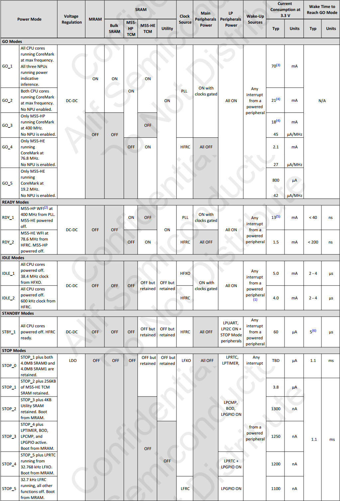
<figcaption>
Datasheet Power Modes from Ensemble E4 Datasheet
</figcaption>
</figure>

## E3 Datasheet Power Modes

<figure>

<figcaption>
Datasheet Power Modes from Ensemble E3 Datasheet
</figcaption>
</figure>

## E1C/B1 Series MCU Datasheet Power Modes

<figure>
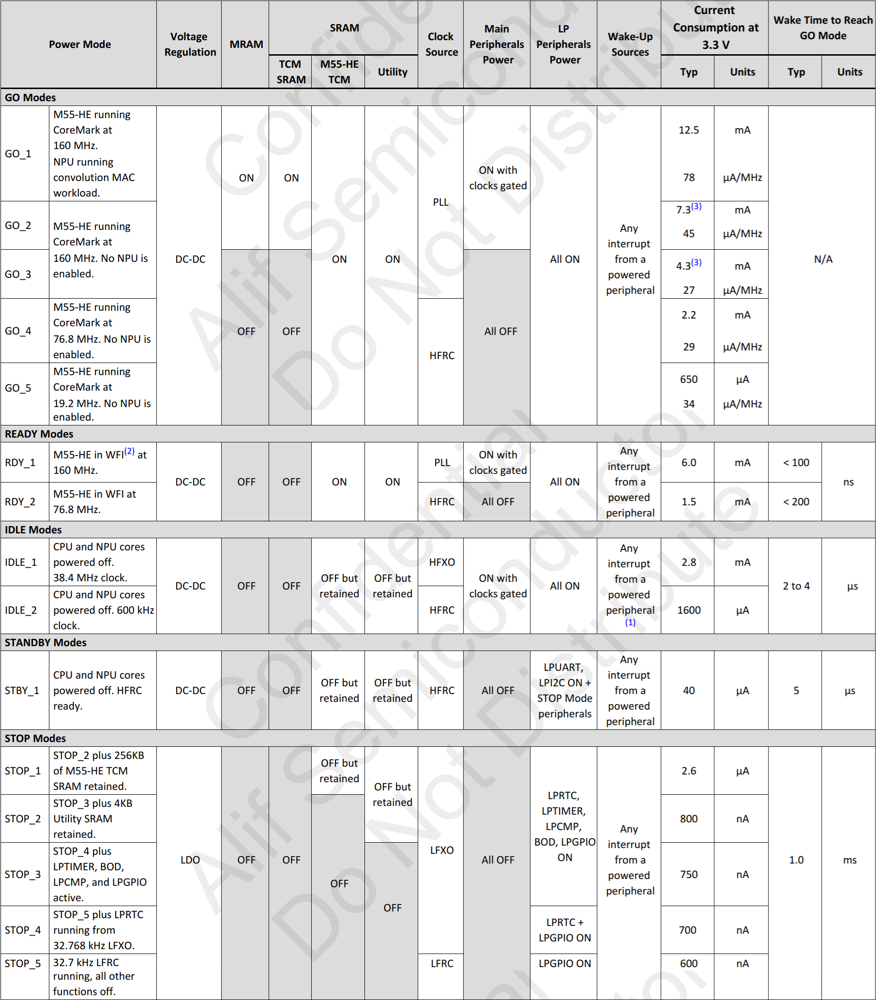
<figcaption>
Datasheet Power Modes from Balletto B1 / Ensemble E1C Datasheet
</figcaption>
</figure>

## MCU GO/READY/IDLE Modes

Using this VSCode project, we have not replicated any GO Modes utilizing the APSS Cortex-A32 cores or RTSS Ethos-U55 NPU units at this time. Although this application note is applicable to the RTSS cores in all Ensemble processors, *what is demonstrated in these examples is equivalent to Ensemble E3 devices running GO_2 and below*.

Additionally, the examples use a while (1) loop instead of CoreMark to load the CPU, so GO_2 and GO_3 power will be slightly lower than shown.

You may run these examples on an E3, E5, E7 device, but you’ll only replicate the power numbers equivalent to an E3 device. Refer to Figure 4 Datasheet Power Modes from Ensemble E3 Datasheet for more information. Refer to the E1, E5, or E7 datasheet for more device specific power modes estimates.

For E8 power estimates, please refer to E8 Datasheet power modes snapshot.

For E1C/B1 power estimates, refer to E1C/B1 Datasheet power modes snapshot.

These examples demonstrate just a sample of the possible power modes and configurations that the Ensemble processor may be in. The significant changes to note between the power modes are as follows:

- MRAM: can be ON or OFF
- Bulk SRAM: SRAM0 and SRAM1 each can individually be ON or OFF
- M55-HP core can be ON (in RUN or SLEEP state), or OFF
- M55-HE core can be ON (in RUN or SLEEP state), or OFF but TCM retained, or OFF
- Main Clock Source: PLL, HFXO, or HFRC
- Main Peripherals (i.e. PD-6 SYST): ON (with peripheral clocks gated) or OFF (dynamic-off)

For the Main Peripherals, *ON with peripheral clocks gated* refers to PD-6 SYST being in the always-on state. The SRAMs, MRAM, and main interconnect are always-on providing the lowest latency and best performance. To use any of the main peripherals, many are clock gated by default and need to be un-gated. Each peripheral will have a different impact on the increased power, so the stated numbers represent a base system power before peripherals are un-gated. *OFF* refers to PD-6 SYST being in the dynamic-off state where main peripherals are unavailable. The ability to control all clock and power mode configurations to match these datasheet power mode examples is possible through aiPM**®** SERVICE requests made to the Secure Enclave Supervisor (SES). aiPM refers to Alif’s autonomous intelligent power management technology that optimizes power efficiency at the system level.

### GO/READY/IDLE Mode Software Examples

File path: common/services_aipm_go_modes.c
File path: common/services_aipm_ready_modes.c
File path: common/services_aipm_idle_modes.c

These software examples demonstrate how to use aiPM SERVICE requests to configure the power and clock controls needed to achieve the low power numbers demonstrated in the device datasheet.

## MCU STANDBY Mode

When the High-Efficiency Region is still on, but all higher numbered domains are off (PD-3 and up), the device is considered to be in STANDBY Mode. While in this mode, PD-0 and PD-2 will be powered on and only the peripherals in these domains can be used to wake the processor out of STANDBY Mode. Use this mode when the processor needs to sleep but also needs to keep the HFXO or HFRC running, such as to retain LPUART or LPI2C peripherals. The processor’s internal DCDC converter should be switched to a more efficient PFM mode to minimize current draw.

### Waking from MCU STANDBY Mode

The same wakeup sources available in the CPU Off State are available in the MCU STANDBY Mode as shown in Table 2 MCU STANDBY Mode Wakeup Sources. To exercise, you need to request that all power domains above PD-2 are not used. Using one of the STANDBY Mode Wakeup Peripherals, simply configure one of the peripherals to generate an interrupt, enable the IRQ in the NVIC, and finally enter the CPU Off state on all cores. When the interrupt is fired, the wakeup event is received on the CPU which had enabled the IRQ in the NVIC. That CPU will begin running the application from the reset vector. At this point the pending interrupt can be observed in the NVIC pending registers and the application can take the appropriate action in response.

| Wakeup Source  | Destination         |
|:---------------|:--------------------|
| LPI2C          | RTSS-HE             |
| LPUART         | RTSS-HE             |
| LPCMP          | RTSS-HE and RTSS-HP |
| LPGPIO\[7:0\]  | RTSS-HE and RTSS-HP |
| LPRTC          | RTSS-HE and RTSS-HP |
| LPTIMER\[3:0\] | RTSS-HE and RTSS-HP |
| MHU IRQs       | RTSS-HE and RTSS-HP |

MCU STANDBY Mode Wakeup Sources

### STANDBY Mode Software Example

File path: common/services_aipm_standby_modes.c

When this example is run, all cores and power domains above PD-2 will turn off. Note that in current SES software the power control for PD-5 is not yet supported, so power will be higher than represented in the datasheet until it is supported.

## MCU STOP Mode

When only the VBAT AON Region is on, and all other regions are off, then the device is in STOP Mode. In STOP mode, the HFRC and HFXO are stopped, leaving only LFXO. The peripherals in PD-0 will continue to run using the LFXO, and they can be used to wake the processor out of STOP Mode.

### STOP Mode Software Example

File path: common/services_aipm_stop_modes.c

# Building and Running the Examples

## Getting Started

Refer to the Getting started guide [Getting started](https://github.com/alifsemi/alif_vscode-template/blob/main/doc/getting_started.md) for installing VSCode, Alif Security toolkit, J-Link software and Git.

Install VSCode with CMSIS extension version v1.38.0 and clone the aiPM project with the instructions below. This will clone the repo into a directory below the directory from which the command is run. Ideally, this command should be run from a VS Code terminal window.

git clone https://github.com/alifsemi/alif_ensemble-vscode-aiPMExamples.git

cd [ensemble_vscode_aiPMExamples_DEV](https://github.com/AlifSemiDev/ensemble_vscode_aiPMExamples_DEV/tree/Incorporate_review_comments)

git submodule update –init

Open the project in VSCode. This project supports multicore compilation and programming. Follow the instructions below to build the project and program the board with the software.

1)  Open the maintenance tool in app-release-exec-windows-SE_FW_1.107.000_DEV\app-release-exec (or a later version) in the cmd prompt and determine the SE UART Port assignment. Refer to “Determining UART Port Assignment” section in the [DevKit User Guide](https://alifsemi.com/support/kits/ensemble-devkit-gen2/)

2)  Delete the out and tmp folder on VSCode. This ensures that the VScode builds the project from scratch.

3)  Press F1 in VScode and in Run Tasks, choose *Build multicore* *(debug)*. This builds the HE and HP binaries for both E7 and E8.

<figure>
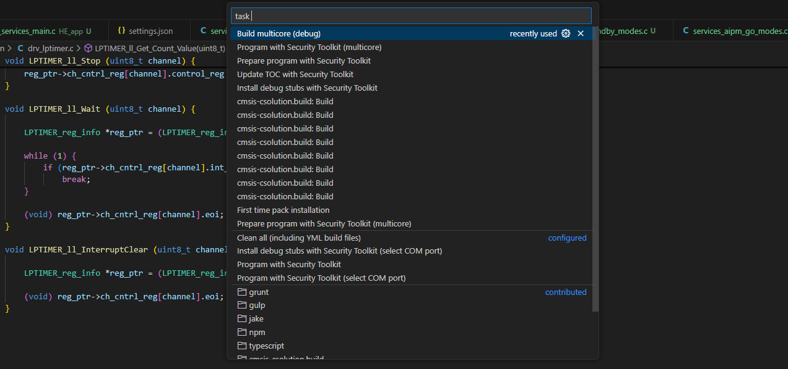
<figcaption>
VSCode building project
</figcaption>
</figure>

The program builds and generates the binaries and elf file for HE and HP applications in the out folder.

Press F1 and in Run Tasks choose *Program with Security Toolkit* *(multicore)* based on the version being built. (E7 or E8). Please refer to the snapshot below.

<figure>
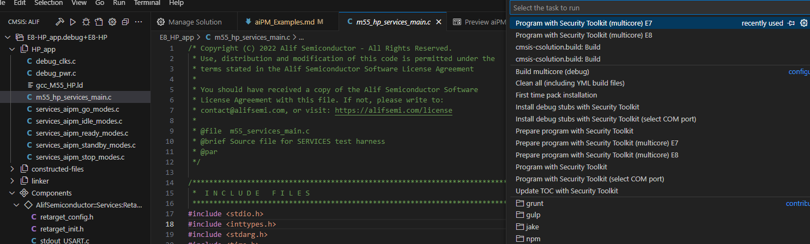
<figcaption>
VSCode programming the board
</figcaption>
</figure>

For E1C/B1 , please use the CMSIS view to build the project using the build icon. 

Press F1 and in Run Tasks choose *Program with Security Toolkit* to flash the software on the board.

# Notes Before Running an Example on the DevKit

## Datasheet Power Mode Examples

For Ensemble E3, E5, E7 and E8 these demo applications expect both the HE and the HP cores to be running the same power mode example together. Although only one core may be running at the end of the power example, such as with GO_3, both cores need to be enabled and running the power modes example at the start. For the E1 then only the HE core needs to be built and run. Refer to Figure 4 Datasheet Power Modes from Ensemble E3 Datasheet for more information or, refer to the E1 Datasheet if you are only exercising the RTSS-HE. Currently, the examples are not able to exercise the APSS Cortex-A32 cores or the RTSS Ethos-U55 NPUs. These power modes examples only exercise the RTSS subsystems. Your power results will be the same as those in Figure 1 whether you are using an E3, E5, or E7 processor. For E8, please refer to the E8 Datasheet Power Modes figure.

Note: When JTAG is active, the WFI/WFE are in no-op, the device will not enter any low power mode. The examples need to be built and run on the board using the MRAM flash instructions using the Security toolkit given in the building section above.

# Running an Example on the Board (E7)

Please feel free to either use a FTDI cable for using the LPUART. In the below example, for E7, a jumper connection has been made from LPUART to USB jumper J26. In E8, a  FTDI cable has been connected to the LPUART directly.

A command line interface has been developed to enable the user to run demo examples for all the power types and their respective modes. The following demonstrates an example of using the CLI and how to choose the power type and mode.

Connect the LPUART ports P9.1(Rx) and P9.2(Tx) to the UART to USB Jumper J26 as seen in the snapshot below:

<figure>

<figcaption>
UART connections
</figcaption>
</figure>

| MCU Pin | J14 Pin | J26 Pin |
|:--------|:--------|:--------|
| P9.1    | J14.24  | J26.3   |
| P9.2    | J14.23  | J26.4   |

<figure>
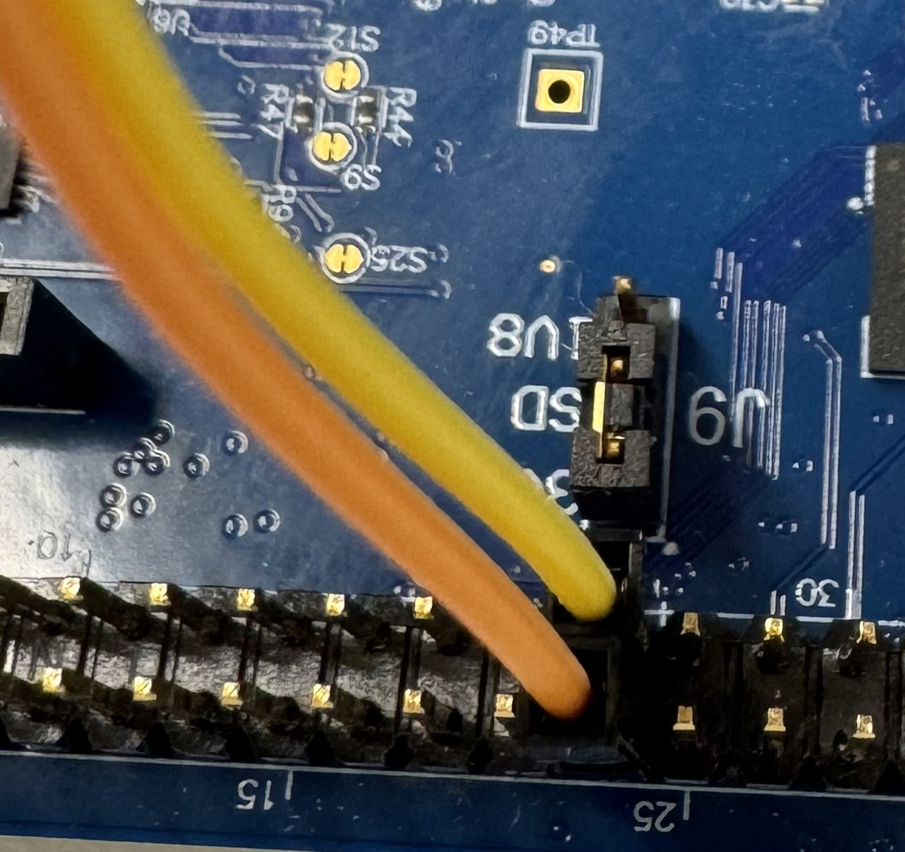
<figcaption>
J14 Connections
</figcaption>
</figure>

<figure>
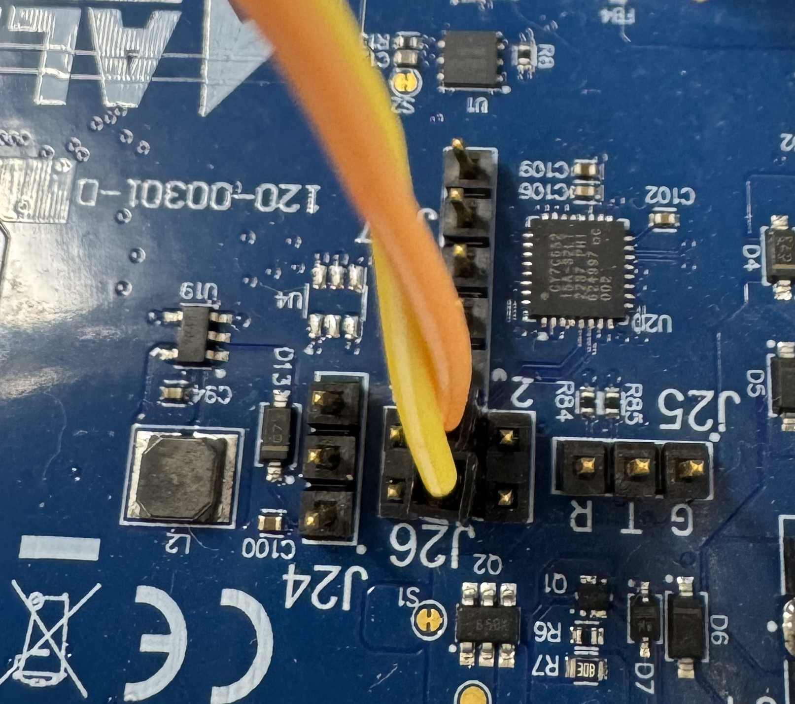
<figcaption>
J26 Connections
</figcaption>
</figure>

# Running an Example on the Board (E8)

Connect the LPUART ports P9.1(Rx) and P9.2(Tx) to a FTDI cable. Set the FTDI cable to 1.8V.

# Running an Example on the Board (E1C/B1)

After flashing the software on the board, set the UART jumper to LP and open Teraterm to connect to the CLI.

# CLI Application

The CLI application requires a serial communication interface. It is suggested to use tools like Teraterm/Putty. The below instructions demonstrate the setup of Teraterm. Teraterm executable is available for download in the following link.

[Teraterm download](https://sourceforge.net/projects/tera-term/)

1)  Open teraterm on the available serial port (this port is different than the port that was assigned to SEUART) and set the baudrate to 115200

<figure>
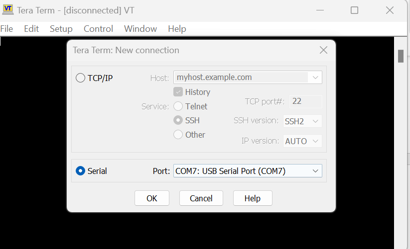
<figcaption>
Teraterm terminal settings1
</figcaption>
</figure>

<figure>
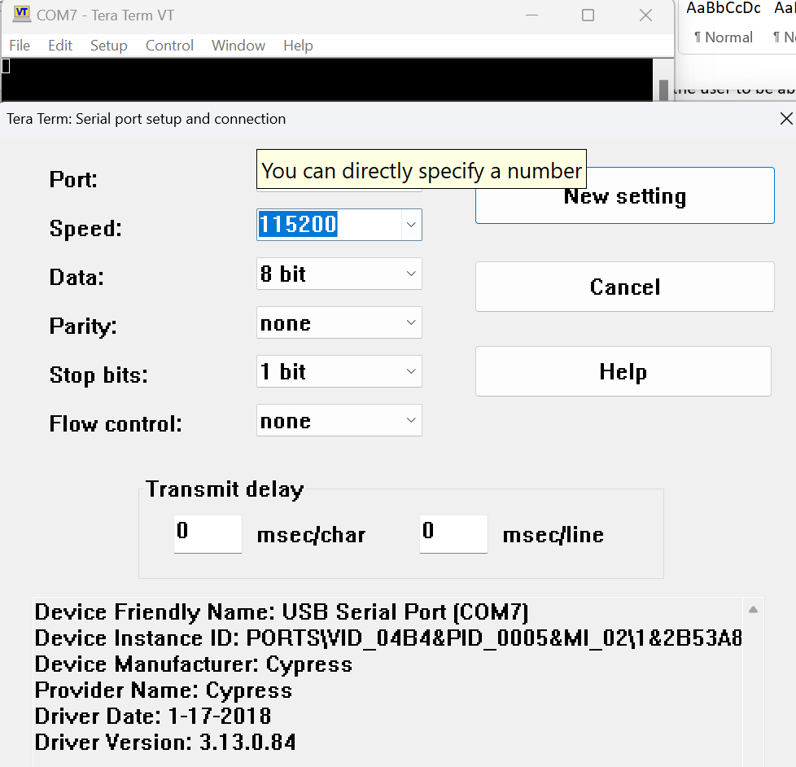
<figcaption>
Teraterm terminal settings2
</figcaption>
</figure>

<figure>
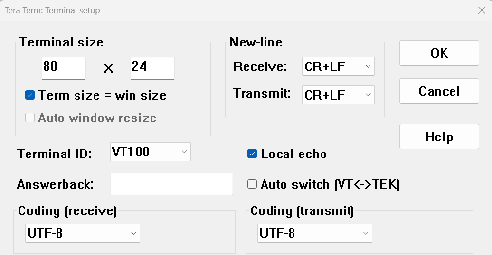
<figcaption>
Teraterm terminal settings3
</figcaption>
</figure>

<figure>
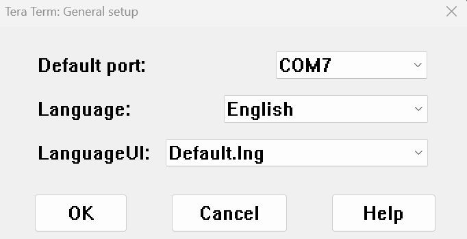
<figcaption>
Teraterm terminal settings4
</figcaption>
</figure>

2)  Run the maintenance tool and choose Option 4 Utilities and, choose 1 for Terminal Mode and press the RESET button on the board. This starts the program and runs to main and the CLI pops up on the Terminal.

<figure>
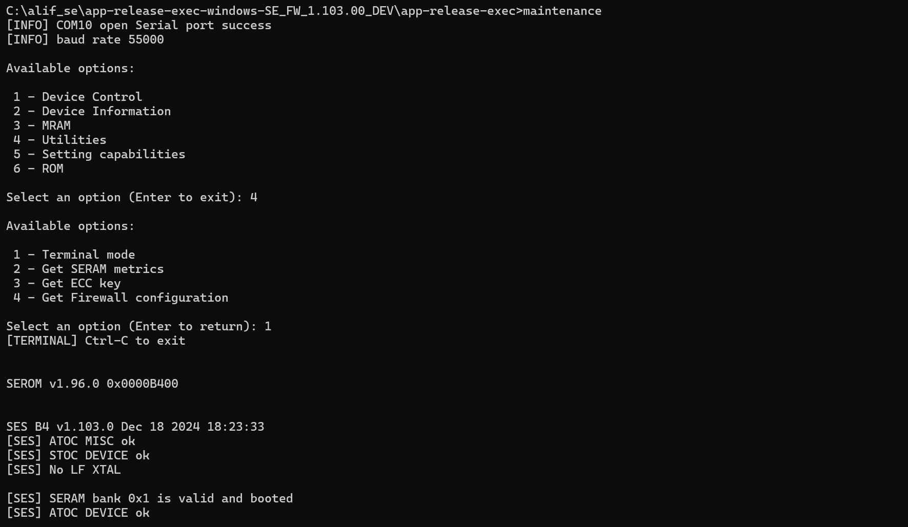
<figcaption>
Terminal mode maintenance tool
</figcaption>
</figure>

The serial terminal window shows a user friendly CLI application. It allows the user to choose the respective power modes to run from.

<figure>
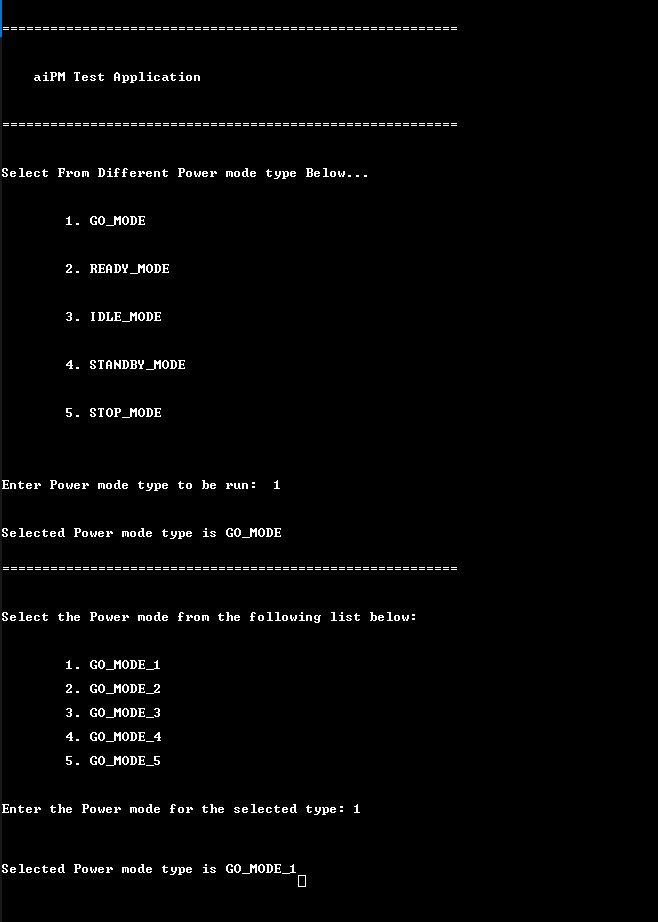
<figcaption>
Command line interface tool
</figcaption>
</figure>

The maintenance application displays the chosen mode. Yellow and green signify both HE and HP core running the examples.

<figure>
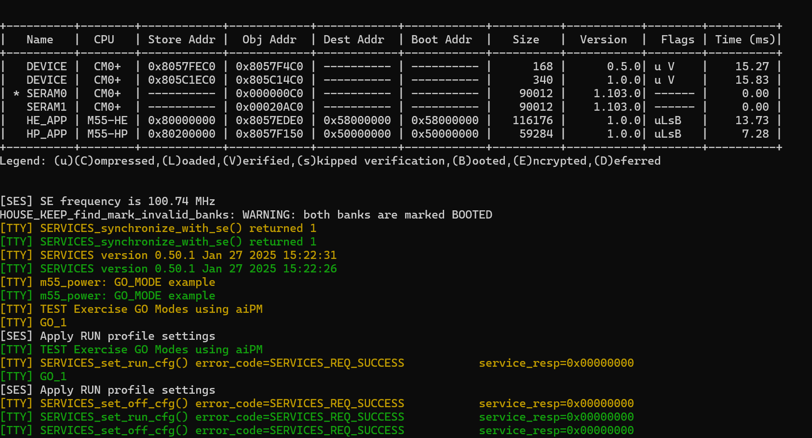
<figcaption>
Maintenance tool log
</figcaption>
</figure>

# Results of Running the Examples on the Board (E8)

## GO Modes

GO mode definitions use Coremark to load the CPU cores. In these sample applications we are only loading the CPU cores with a while(1) loop so power consumption will be lower than if the CPU cores were running Coremark.

<figure>
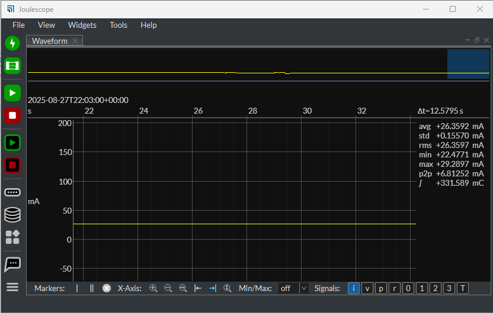
<figcaption>
Screenshot of GO_1
</figcaption>
</figure>

The above screenshot demonstrates GO_1 at 26.3mA.

<figure>
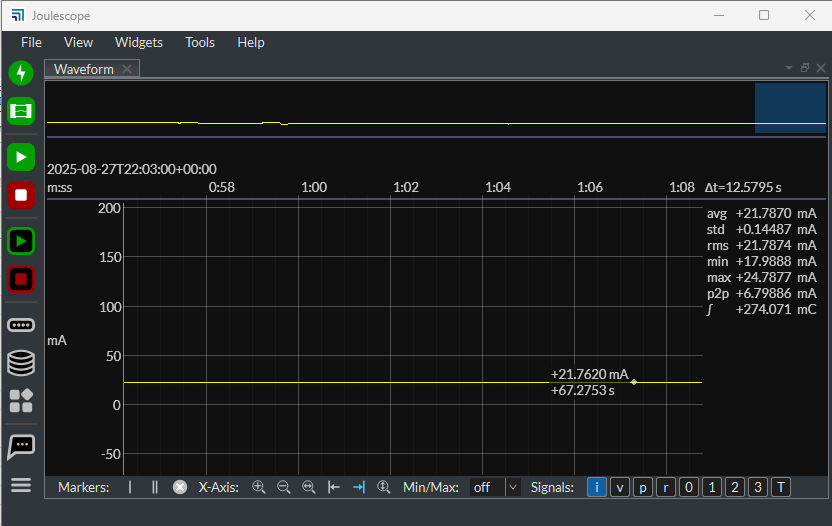
<figcaption>
Screenshot of GO_2
</figcaption>
</figure>

The above screenshot demonstrates GO_2 at 21.7mA

<figure>
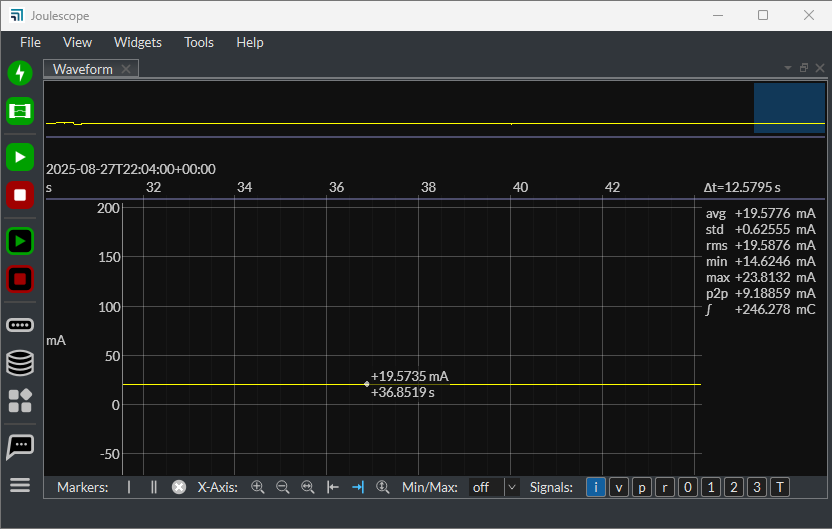
<figcaption>
Screenshot of GO_3
</figcaption>
</figure>

The above screenshot demonstrates GO_3 at 19.5mA

<figure>

<figcaption>
Screenshot of GO_4
</figcaption>
</figure>

The above screenshot demonstrates GO_4 at 2.51mA

<figure>
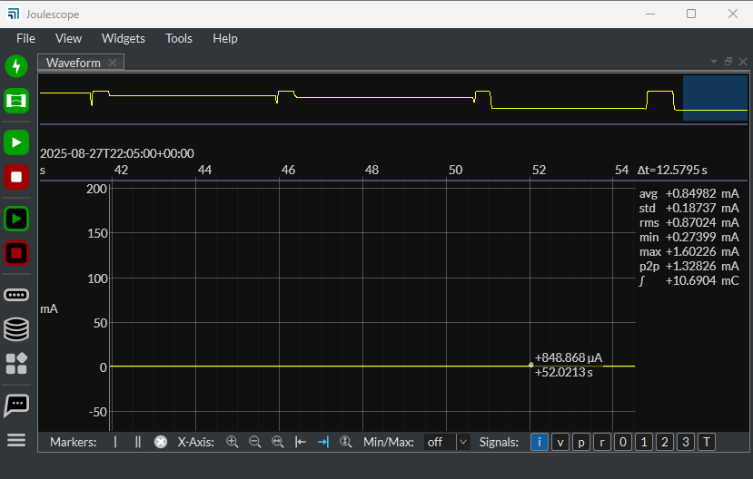
<figcaption>
Screenshot of GO_5
</figcaption>
</figure>

The above screenshot demonstrates GO_5 at 849uA

## READY Modes

<figure>
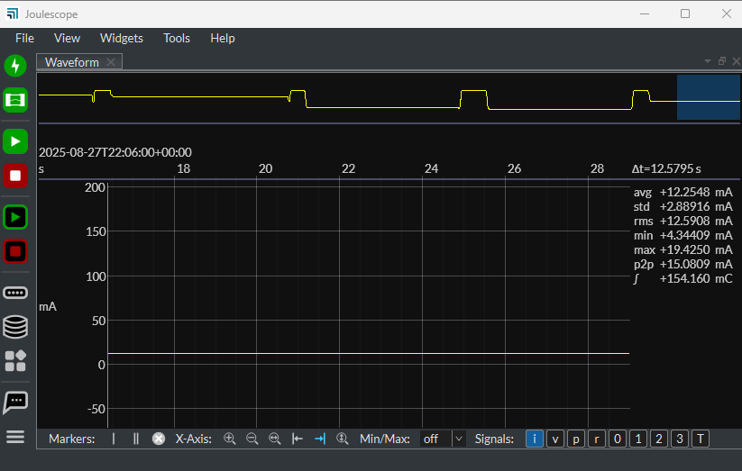
<figcaption>
Screenshot of READY_1
</figcaption>
</figure>

The above screenshot demonstrates READY_1 at 12.25mA

<figure>
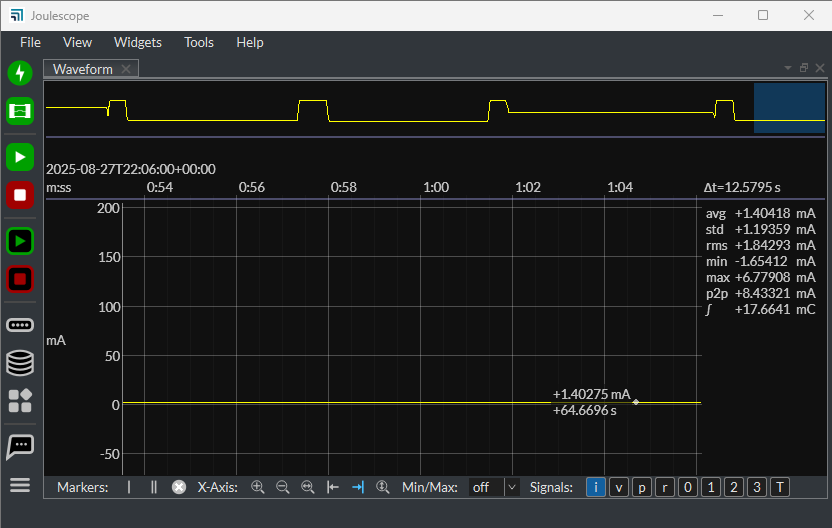
<figcaption>
Screenshot of READY_2
</figcaption>
</figure>

The above screenshot demonstrates READY_2 at 1.4mA

## IDLE Modes

<figure>
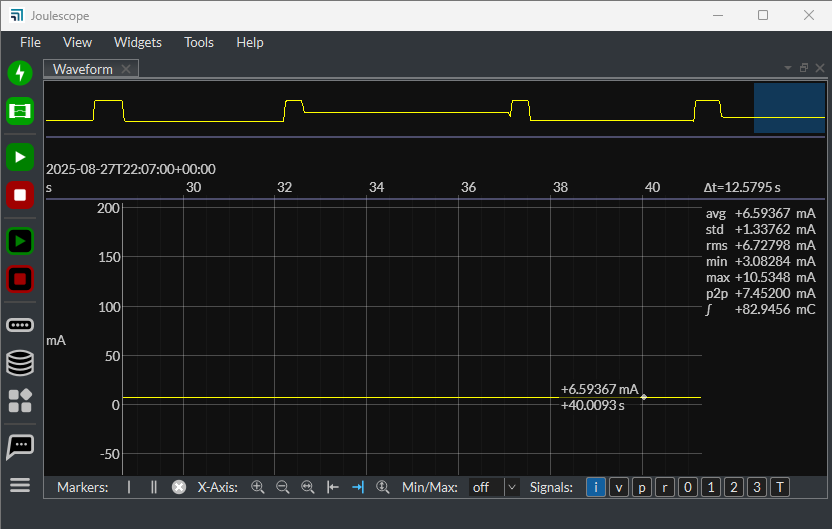
<figcaption>
Screenshot of IDLE_1
</figcaption>
</figure>

The above screenshot demonstrates IDLE_1 at 6.59mA.

<figure>
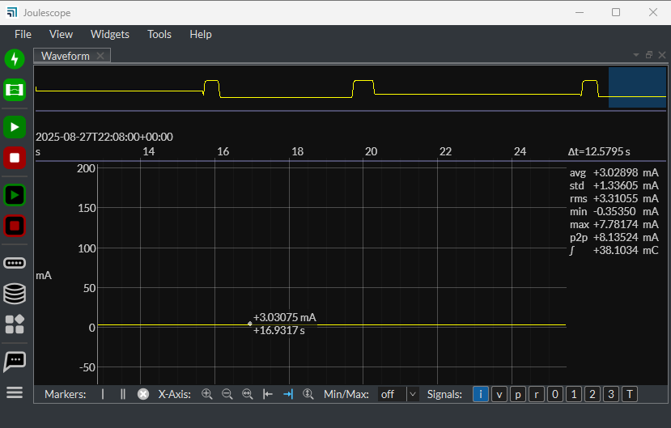
<figcaption>
Screenshot of IDLE_2
</figcaption>
</figure>

The above screenshot demonstrates IDLE_2 at 3.02mA.

## STANDBY Modes

<figure>
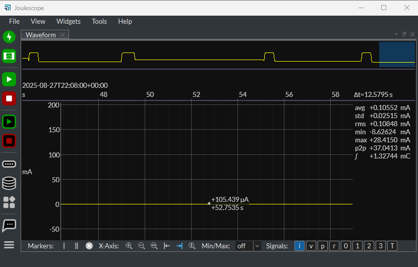
<figcaption>
Screenshot of STANDBY_1
</figcaption>
</figure>

The above screenshot demonstrates STANDBY_1 at 105uA.

## STOP Modes

Depending on silicon revision, there is higher than expected leakage during STOP Mode. The screenshots below are real-world measurements on the current silicon revision (Rev. A0). This will be fixed in the next silicon revision (Rev. A1) and you should expect the current draw to decrease and match the numbers stated in the datasheet.

<figure>
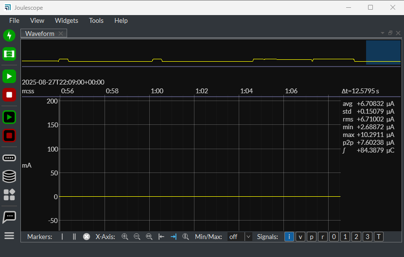
<figcaption>
Screenshot of STOP_1
</figcaption>
</figure>

The above screenshot demonstrates STOP_1 at 6.7uA

<figure>
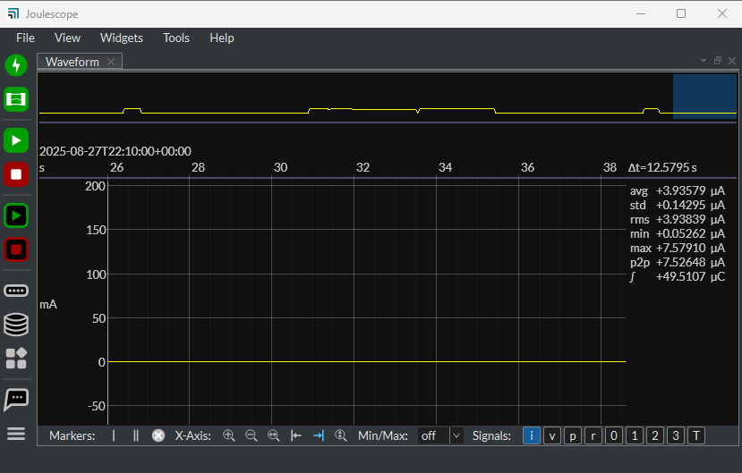
<figcaption>
Screenshot of STOP_2
</figcaption>
</figure>

The above screenshot demonstrates STOP_2 at 3.93uA

<figure>
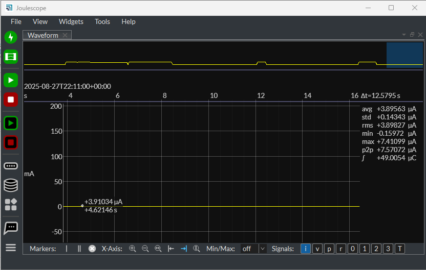
<figcaption>
Screenshot of STOP_3
</figcaption>
</figure>

The above screenshot demonstrates STOP_3 at 3.89uA

<figure>
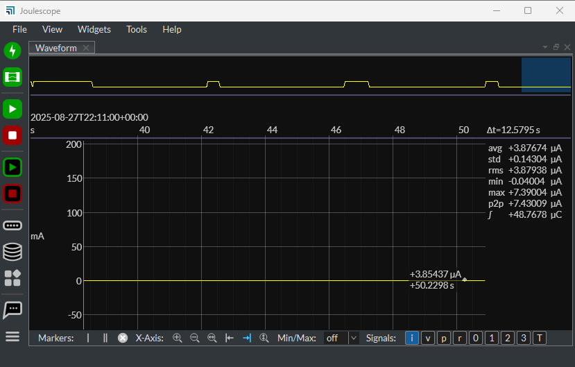
<figcaption>
Screenshot of STOP_4
</figcaption>
</figure>

The above screenshot demonstrates STOP_4 at 3.87uA

<figure>

<figcaption>
Screenshot of STOP_5
</figcaption>
</figure>

The above screenshot demonstrates STOP_5 at 3.68uA

# Results of Running the Examples on the Board (E7)

## GO Modes

GO mode definitions use Coremark to load the CPU cores. In these sample applications we are only loading the CPU cores with a while(1) loop so power consumption will be lower than if the CPU cores were running Coremark.

<figure>
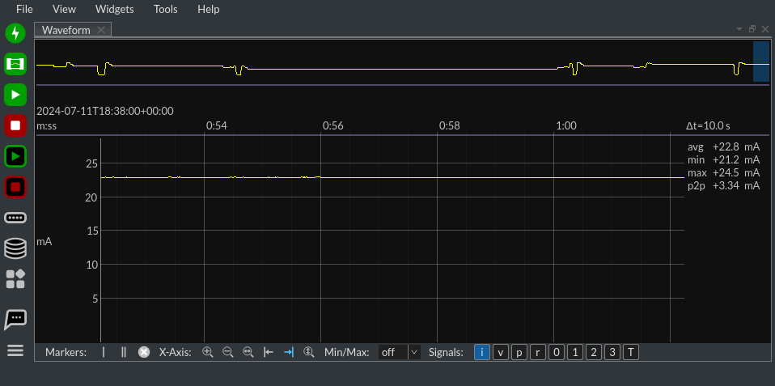
<figcaption>
Screenshot of GO_2
</figcaption>
</figure>

The above screenshot demonstrates GO_2 at 22.8mA.

<figure>
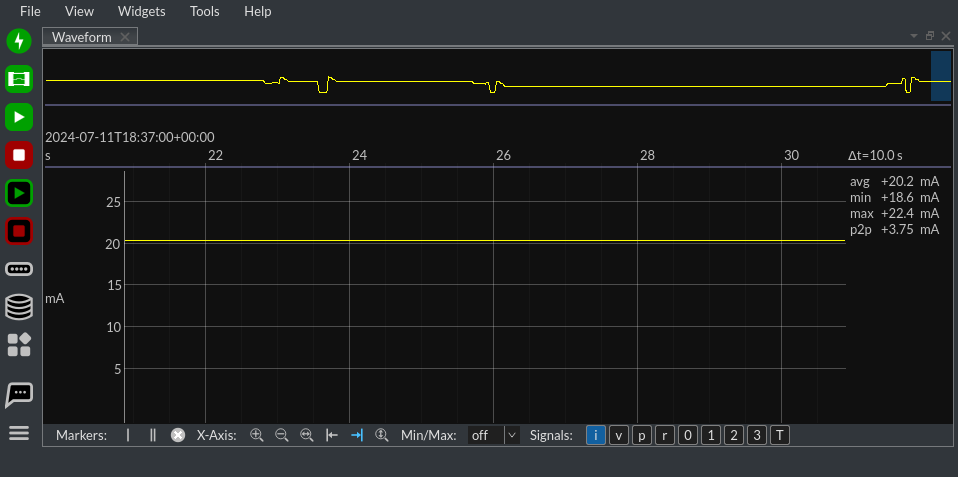
<figcaption>
Screenshot of GO_3
</figcaption>
</figure>

The above screenshot demonstrates GO_3 at 20.2mA

<figure>

<figcaption>
Screenshot of GO_4
</figcaption>
</figure>

The above screenshot demonstrates GO_4 at 2.35mA

<figure>

<figcaption>
Screenshot of GO_5
</figcaption>
</figure>

The above screenshot demonstrates GO_5 at 847uA

## READY Modes

<figure>
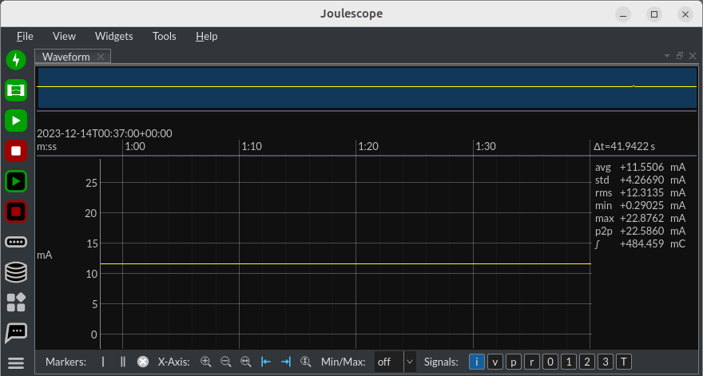
<figcaption>
Screenshot of READY_1
</figcaption>
</figure>

The above screenshot demonstrates READY_1 at 11.55mA

<figure>
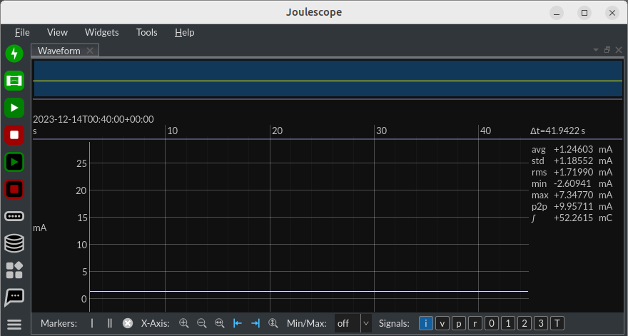
<figcaption>
Screenshot of READY_2
</figcaption>
</figure>

The above screenshot demonstrates READY_2 at 1.25mA

## IDLE Modes

<figure>
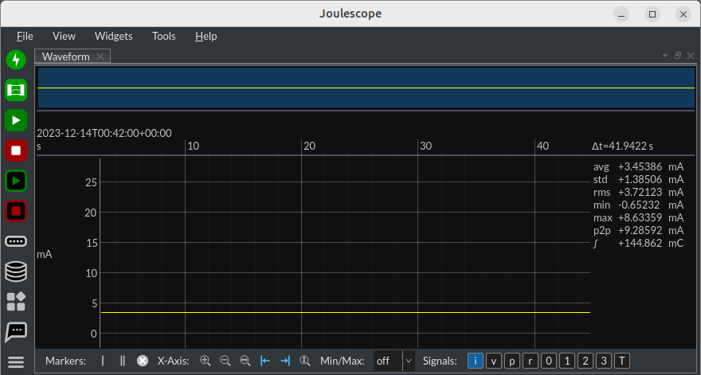
<figcaption>
Screenshot of IDLE_1
</figcaption>
</figure>

The above screenshot demonstrates IDLE_1 at 3.45mA.

<figure>
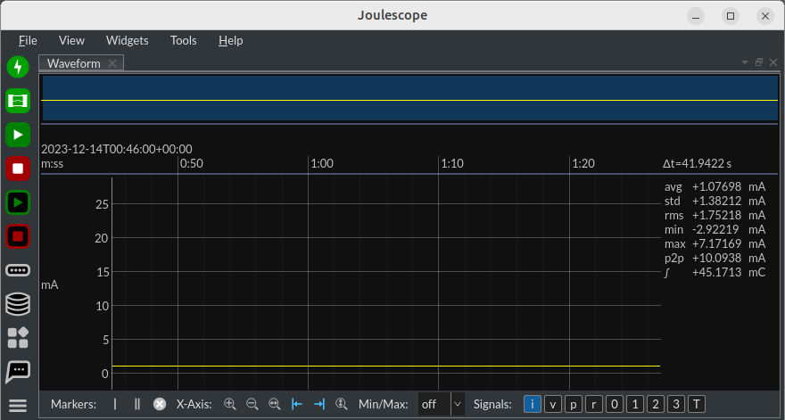
<figcaption>
Screenshot of IDLE_2
</figcaption>
</figure>

The above screenshot demonstrates IDLE_2 at 1.08mA.

## STANDBY Modes

<figure>
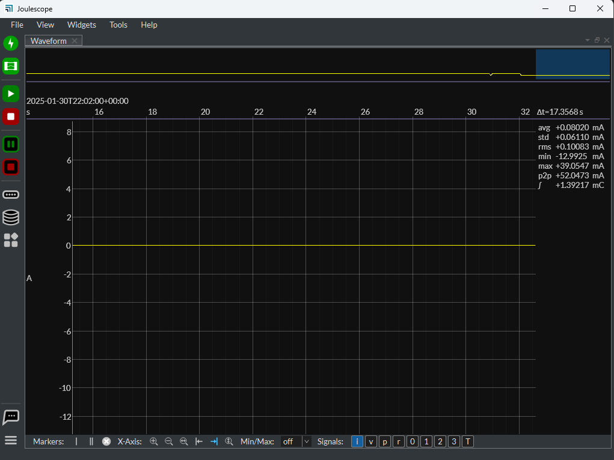
<figcaption>
Screenshot of STANDBY_1
</figcaption>
</figure>

The above screenshot demonstrates STANDBY_1 at 80uA.

## STOP Modes

<figure>

<figcaption>
Screenshot of STOP_1
</figcaption>
</figure>

The above screenshot demonstrates STOP_1 at 5.64uA

<figure>
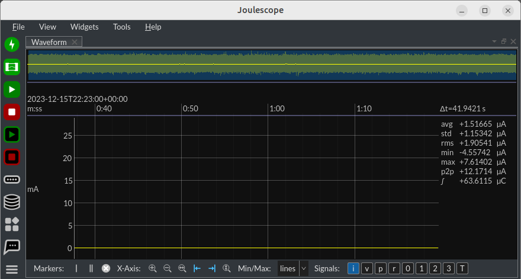
<figcaption>
Screenshot of STOP_2
</figcaption>
</figure>

The above screenshot demonstrates STOP_2 at 1.52uA

<figure>

<figcaption>
Screenshot of STOP_3
</figcaption>
</figure>

The above screenshot demonstrates STOP_3 at 1.475uA

<figure>
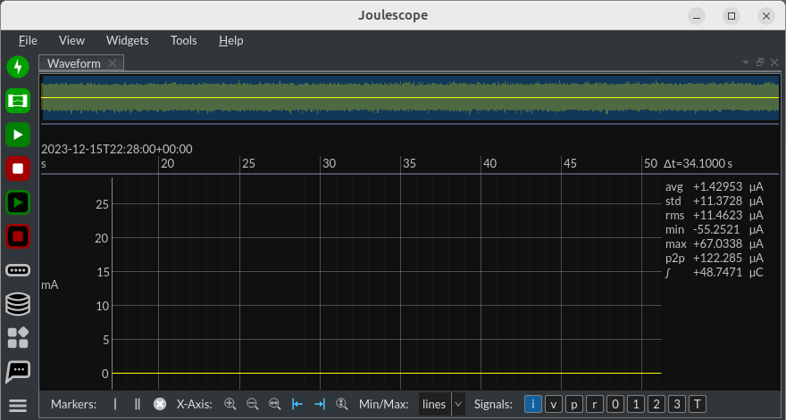
<figcaption>
Screenshot of STOP_4
</figcaption>
</figure>

The above screenshot demonstrates STOP_4 at 1.43uA

<figure>

<figcaption>
Screenshot of STOP_5
</figcaption>
</figure>

The above screenshot demonstrates STOP_5 at 1.26uA

# Results of Running the Examples on the Board (E1C/B1)

## GO Modes

<figure>
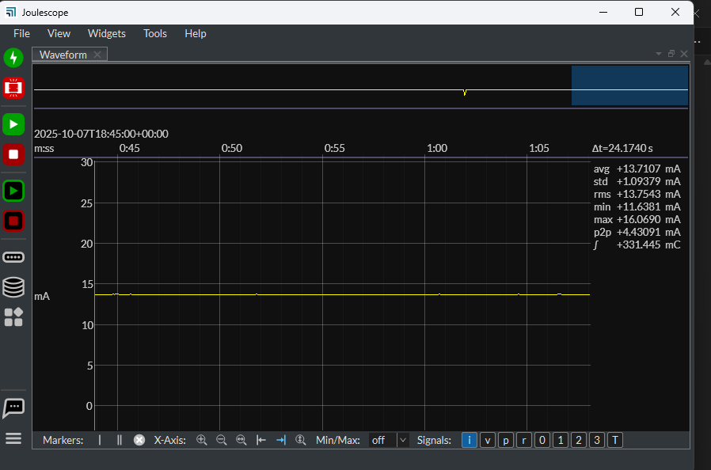
<figcaption>
Screenshot of GO_1
</figcaption>
</figure>

The above screenshot demonstrates GO_1 at 13.7mA.

<figure>
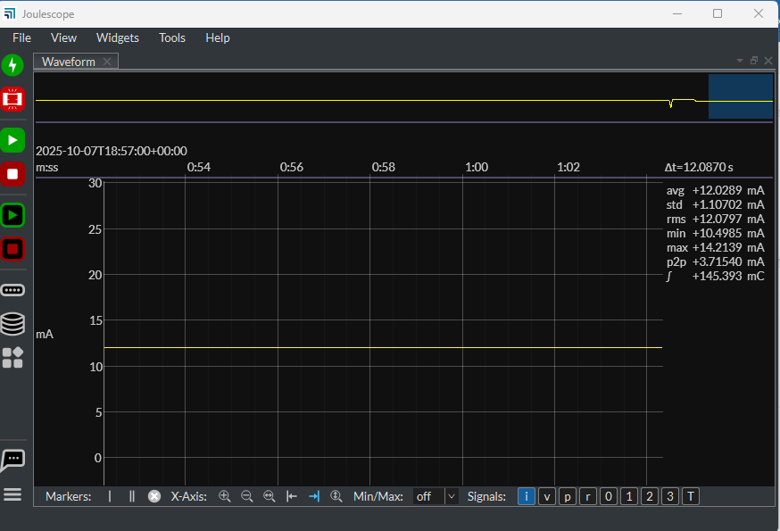
<figcaption>
Screenshot of GO_2
</figcaption>
</figure>

The above screenshot demonstrates GO_2 at 12.03mA

<figure>
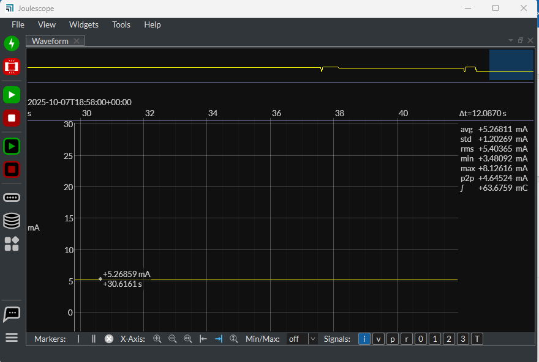
<figcaption>
Screenshot of GO_3
</figcaption>
</figure>

The above screenshot demonstrates GO_3 at 5.26mA

<figure>

<figcaption>
Screenshot of GO_4
</figcaption>
</figure>

The above screenshot demonstrates GO_4 at 3.85mA

<figure>

<figcaption>
Screenshot of GO_5
</figcaption>
</figure>

The above screenshot demonstrates GO_5 at 1.24uA

## READY Modes

<figure>

<figcaption>
Screenshot of READY_1
</figcaption>
</figure>

The above screenshot demonstrates READY_1 at 4.91mA

<figure>

<figcaption>
Screenshot of READY_2
</figcaption>
</figure>

The above screenshot demonstrates READY_2 at 2.08mA

## IDLE Modes

<figure>

<figcaption>
Screenshot of IDLE_1
</figcaption>
</figure>

The above screenshot demonstrates IDLE_1 at 4.44mA.

<figure>

<figcaption>
Screenshot of IDLE_2
</figcaption>
</figure>

The above screenshot demonstrates IDLE_2 at 0.527mA.

## STANDBY Modes

<figure>
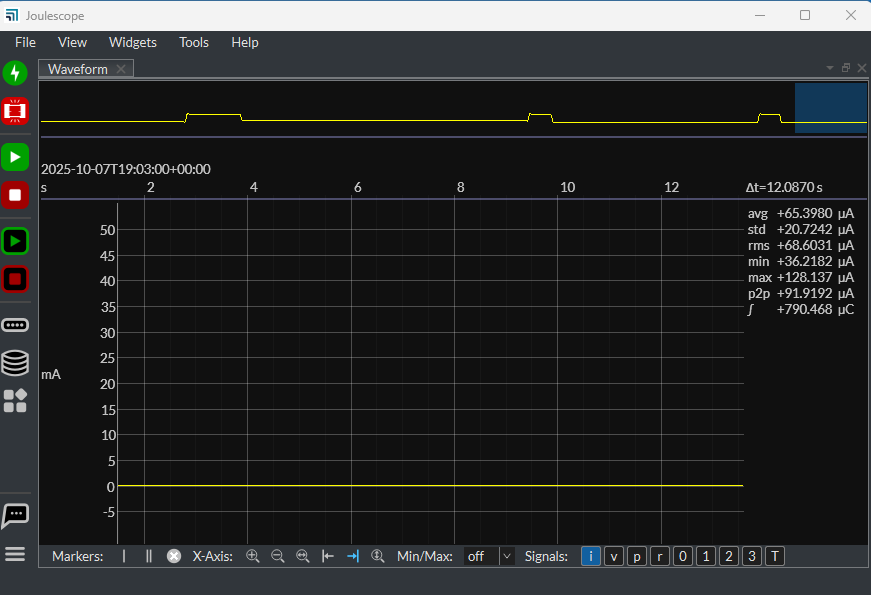
<figcaption>
Screenshot of STANDBY_1
</figcaption>
</figure>

The above screenshot demonstrates STANDBY_1 at 65.39uA.

## STOP Modes

Depending on silicon revision, there is higher than expected leakage during stop mode. The screenshots below are real-world measurements on the current silicon revision (Rev. A5). This will be fixed in the next silicon revision (Rev. A7) and you should expect the current draw to decrease and match the numbers stated in the datasheet.

<figure>
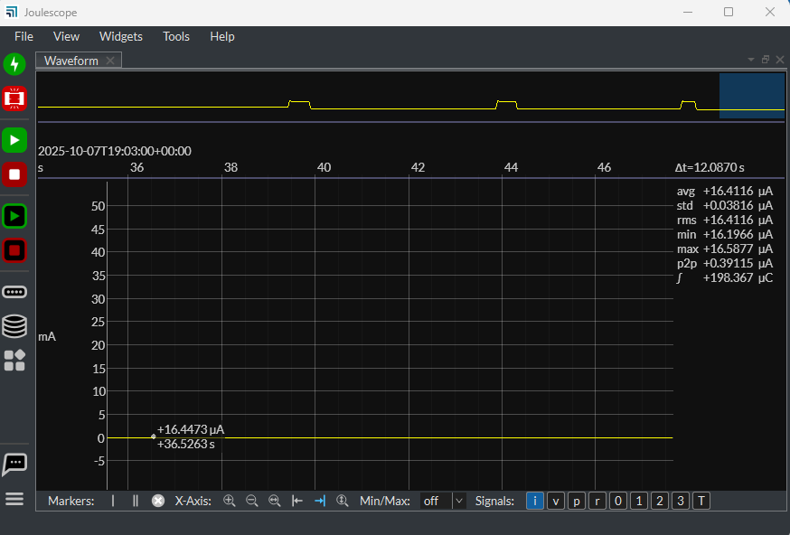
<figcaption>
Screenshot of STOP_1
</figcaption>
</figure>

The above screenshot demonstrates STOP_1 at 16.4uA

<figure>

<figcaption>
Screenshot of STOP_2
</figcaption>
</figure>

The above screenshot demonstrates STOP_2 at 14.9uA

<figure>

<figcaption>
Screenshot of STOP_3
</figcaption>
</figure>

The above screenshot demonstrates STOP_3 at 14.88uA

<figure>
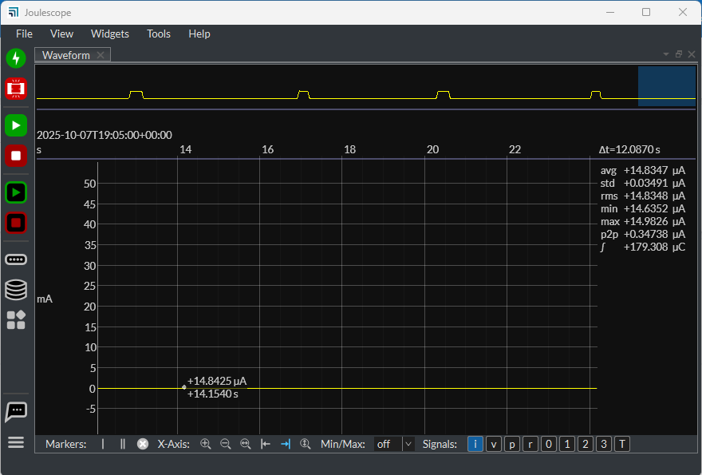
<figcaption>
Screenshot of STOP_4
</figcaption>
</figure>

The above screenshot demonstrates STOP_4 at 14.83uA

<figure>

<figcaption>
Screenshot of STOP_5
</figcaption>
</figure>

The above screenshot demonstrates STOP_5 at 14.72uA

##  Restoring the Board From An Illegal Condition

The example applications in this repo are designed so that after entering a selected power mode and taking the measurements, user can return to the initial state where the CLI is looking for a selection of power mode, just press the RESET button.

Due to an application changing clock modes or power modes without a way to wake up to a known state, or if an application has illegal memory accesses, the program may “hang” and the SEUART communication may stop responding.

To restore the board, please follow the steps below to enter “hard maintenance mode” which will allow the user to erase the illegal application so you can program a new application. Hard Maintenance mode is a useful safe mode which prevents the SE from booting any applications written to MRAM, and it prevents the SE from enabling any external crystal or PLL.

> \# Start maintenance tool
>
> \# Enter option 1 then option 1 again
>
> \>maintenance
>
> 1
>
> 1
>
> \# Now press the RESET button on the Development Kit
>
> Run the maintenance tool to erase MRAM and Reflash the software. Refer to the Getting Started section of Building and Running the Examples earlier in this document.

# Troubleshooting

Problem: Application that is using Ethos-U does not enter STOP Mode; the M55 core does not power off after and continues running after pm_core_enter_deep_sleep_request_subsys_off()

Suggestion: Please make sure that you have called ETHOSU_PMU_Disable() before trying to power off the M55 core. If you have called ETHOSU_PMU_Enable() we saw this blocking the device going to STOP mode.

# Legal and Support Information

## Disclaimers

**Legal Notice – Please Read**

Alif Semiconductor™ reserves the right, without notice, to alter, edit, update, make corrections, and

improvements to Alif documentation and products at any time. It is the responsibility of customers to

maintain the most current versions of documentation before making any purchases from Alif. The

information found in this documentation is provided to purchasers solely for the purpose of enabling

hardware and software implementation of Alif products.

Alif neither takes any responsibility for, nor guarantees the appropriateness of, its products for a specific

purpose. Customers accept the responsibility for the selection and incorporation of Alif products into their systems and Alif has no liability with respect thereto. ALIF ALSO DISCLAIMS ANY AND ALL LIABILITY WITH RESPECT THERETO, INCLUDING WITHOUT LIMITATION, DIRECT, CONSEQUENTIAL, INDIRECT, SPECIAL AND INCIDENTAL DAMAGES. ADDITIONALLY, ALIF DISCLAIMS AND EXCLUDES ALL WARRANTIES, WHETHER STATUTORY, EXPRESS OR IMPLIED, INCLUDING ANY IMPLIED WARRANTY OF MERCHANTABILITY, FITNESS FOR A PARTICULAR PURPOSE AND NON-INFRINGEMENT AND THOSE ARISING FROM COURSE OF DEALING AND USAGE OF TRADE.

Alif Semiconductor and the Alif logo are trademarks of Alif. For more information about our trademarks

please visit our website at <https://alifsemi>.com/legal/. The omission of any Alif trademark, product name or any other name from this list does not constitute a waiver of Alif’s intellectual property rights.

The recipient of this document does not have permission to copy, reprint, reproduce, duplicate, share, in any form, in whole or in part, unless prior written consent from Alif is obtained.

Please contact an Alif representative at contact@alifsemi.com if you have any questions regarding the

information in this document. Alif sells products according to standards terms and conditions of sales, which can be found at: <https://alifsemi.com/legal/>

## Related Documents and Tools

- Alif Semiconductor device series-specific Hardware Reference Manual (HWRM)

- Alif Semiconductor device series-specific Software Reference Manual (SWRM)

- Alif Semiconductor device series-specific Datasheet

For additional Alif Semiconductor technical documentation and software resources please visit:

- [User Guides & App Notes](https://alifsemi.com/support/application-notes-user-guides/ensemble/)

- [Software & Tools](https://alifsemi.com/support/software-tools/ensemble/)

For managing software configurations of device resources, power, pins, clocks, DMA requests, interrupts, and various other additional settings, refer to the [Alif Conductor](https://conductor.alifsemi.com/) tool.

## Contact Information

For more information visit our website Alif Semiconductor ([www.alifsemi](http://www.alifsemi).com) or contact us:

contact@alifsemi.com

US HQ – Silicon Valley, CA

7901 Stoneridge Drive, Suite 300

Pleasanton, CA 94588

## Trademarks

The Alif logo, Ensemble, and *ai*PM are trademarks of Alif Semiconductor. For additional information about Alif Semiconductor trademarks, refer to <https://alifsemi>.com/legal/.

Arm, Cortex, CoreSight, TrustZone, AMBA, Thumb, and Ethos are registered trademarks or trademarks of Arm Limited (or its subsidiaries) in the US and/or elsewhere.

Neon, and Helium are trademarks of Arm Limited (or its subsidiaries) in the US and/or elsewhere.

Secure Digital and SD is a registered trademark of SD Card Association.

Synopsys & DesignWare are registered trademarks of Synopsys, Inc.

eMMC is trademarks of MultiMediaCard Association.

All other product or service names are the property of their respective owners.

# Document History

| Version | Change Log |
|:---|:---|
| 1.0 | Initial public release |
| 1.1 | Added “Troubleshooting” section. Updated Figure 3 to reflect Datasheet v2.8. Updated GO_2 and GO_3 screen shots to reflect Coremark power draw instead of while (1) power draw. |
| 1.2 | Modified the document to accommodate multi-core building using VSCode. Added the instructions to use the CLI. Eliminated the manual building and cmake related commands since it is no longer applicable. |
| 1.3 | Removed the incorrect git project hyperlink |
| 1.4 | Rewrote sections on returning to the initial demo program state and restoring a board with a hung application |
| 1.5 | Changed the app note to support E8 and E7 using SE 107.00 and CMSIS DFP 2.0.2 |
| 1.6 | Added the E1C demo support |
